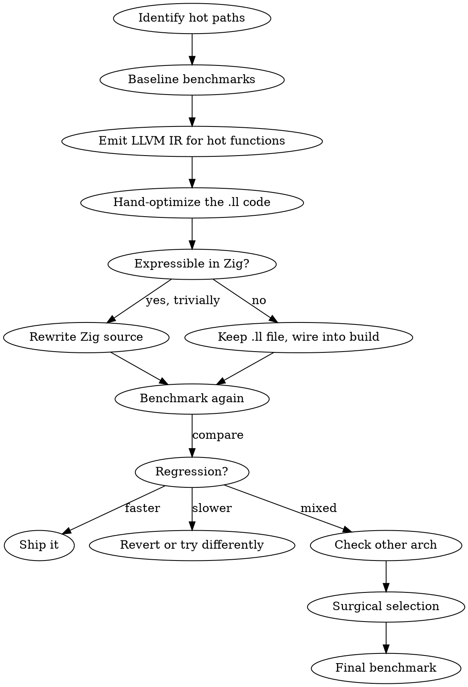

# LLVM-Guided Optimization

## Overview

Optimize Zig hot paths by emitting LLVM IR, hand-optimizing it, and shipping the optimized `.ll` files alongside the Zig source. Two output paths:

1. **Keep the `.ll` file** -- when the optimization can't be expressed in Zig (custom SIMD scheduling, register allocation hints, intrinsics Zig doesn't expose). The hand-optimized `.ll` is a **shipping artifact**, compiled via the build system.
2. **Rewrite the Zig** -- when studying the IR reveals that a Zig-level change (readInt, @Vector, slicing patterns) produces the same improved codegen. Simpler to maintain.

<important>
Default to path 1 (keep the `.ll`). Only fall back to path 2 if the optimization is trivially expressible in Zig. Do NOT take the shortcut of "translating back to Zig" when the hand-optimized IR contains optimizations that Zig can't express.
</important>

<remember>
Core principle: Emit IR, hand-optimize it, benchmark before and after. Some "optimizations" are regressions, especially across architectures.
</remember>

<when_to_use>
- A hot path has been identified and algorithmic improvements are exhausted
- You suspect the compiler is generating suboptimal code (redundant bounds checks, missed SIMD, poor branch layout)
- User says "LLVM optimization", "emit LLVM", "hand-optimize the LLVM"
- After microbenchmarks show a function is slower than expected given its algorithmic complexity
</when_to_use>

<when_not_to_use>
- Before profiling -- don't optimize what isn't hot
- When algorithmic improvements are still available (fix O(n^2) before tweaking codegen)
- For code that runs infrequently (startup, config parsing, error paths)
</when_not_to_use>

## The Workflow



### Step 1: Identify Hot Paths

Use static analysis to find the innermost loops -- functions called once per byte, per block, or per item in the main processing pipeline.

Typical hot paths by domain:
- **Compression:** match finder (BT4/HC), entropy coder, CRC/hash computation
- **Validation:** per-byte/per-block parsers, checksum loops
- **Search/indexing:** scoring functions, substring matching, inner ranking loops
- **Archival:** container expansion/contraction per-block, stream copy

### Step 2: Baseline Benchmarks

<important>
Before touching anything, establish baseline metrics. You'll need them for comparison.
</important>

```bash
# End-to-end (hyperfine)
hyperfine --warmup 3 './zig-out/bin/tool input_file'

# Microbenchmarks (if set up per zig-microbenchmarks skill)
zig build microbench
```

### Step 3: Emit LLVM IR

```bash
# Emit IR for the whole project
zig build -Doptimize=ReleaseFast -Demit-llvm-ir

# Or for a specific file
zig build-obj -OReleaseFast --emit llvm-ir src/hot_module.zig
```

This produces `.ll` files containing the LLVM IR. Open and study the functions you identified in Step 1.

### Step 4: Study IR for Missed Optimizations

Common things to look for in the `.ll` output:

| IR Pattern | Problem | Zig-Level Fix |
|---|---|---|
| `call void @__zig_panic` in hot loop | Bounds check not elided | Use `[ptr..][0..len]` slicing patterns, `@intCast` with known-good range |
| No vector instructions on bulk data | Missed auto-vectorization | Rewrite with `@Vector(N, T)` explicitly |
| Repeated `load` of same struct field | Not hoisted out of loop | Hoist to local variable (but **test on both architectures** -- can increase register pressure) |
| `br` with cold path inline | Poor branch layout | Add `@branchHint(.unlikely)` on error/rare paths (but **test** -- can backfire on aarch64) |
| Multiple byte loads for multi-byte value | No combined load | Use `std.mem.readInt` for 2/4/8-byte loads from byte slices |
| `sext`/`zext` chains | Unnecessary type conversions | Match types to avoid implicit widening |
| No hardware intrinsic for known operation | Missed pattern recognition | Use explicit builtins: `@ctz`, `@clz`, `@popCount`, `@byteSwap` |
| Scalar loop over byte array | Could be SIMD | Use `@Vector` with platform-appropriate width (16 for SSE2, 16 for NEON) |

### Step 5: Hand-Optimize and Integrate

Two paths depending on whether the optimization is expressible in Zig:

#### Path A: Keep the hand-optimized `.ll` file (default)

When the optimization involves custom SIMD scheduling, register hints, intrinsic sequences, or anything Zig can't express -- **keep the `.ll` as a shipping artifact**.

Directory structure:
```
src/
  lib.zig              # Zig core (hot function removed or stubbed)
  llvm/
    match_finder.ll    # Hand-optimized LLVM IR for aarch64
    match_finder_x86.ll  # Hand-optimized LLVM IR for x86_64 (if different)
```

**Compiling `.ll` into the build:**

For C/clang projects, compile with `-flto` so the hand-optimized IR participates in link-time optimization:

```bash
# Compile .ll to .o with LTO (enables cross-module inlining)
clang -O2 -flto -c chudnovsky.ll -o chudnovsky.o
# Link alongside C object files
clang -O2 -flto main.o chudnovsky.o sieve.o -lgmp -o binary
```

For Zig projects, use `addObjectFile` or a system command build step:

<template>
```zig
// build.zig: compile hand-optimized LLVM IR via clang
const clang_step = b.addSystemCommand(&.{
    "clang", "-O2", "-flto", "-c",
});
clang_step.addFileArg(b.path("src/llvm/hot_function.ll"));
clang_step.addArg("-o");
const ll_obj = clang_step.addOutputFileArg("hot_function.o");
lib.addObjectFile(ll_obj);

// For arch-specific variants:
if (target.result.cpu.arch == .aarch64) {
    // use aarch64 .ll
} else {
    // use x86_64 .ll or fall back to Zig implementation
}
```
</template>

The original function (Zig or C) should be kept as a fallback (gated by architecture or a build option) so the code compiles on platforms without a hand-optimized `.ll`.

<example>
**Real-world example:** `llvm-pi/chudnovsky.ll` -- hand-optimized binary splitting for Chudnovsky pi computation. 8 optimizations the C compiler cannot do: direct GMP limb manipulation (0 GMP calls per base case, down from 14), branchless negation via `_mp_size` field flip, `@llvm.cttz.i64` replacing branch loops, cross-product precomputation as native i64/i128, addmul fusion (2 GMP calls per merge, down from 3), and a diff==2 special case eliminating ~352K recursive call pairs at 10M digits. Compiled with `clang -O2 -flto -c` and linked with LTO alongside C modules.
</example>

#### Path B: Rewrite the Zig (when optimization is trivially expressible)

When studying the IR reveals a simple Zig-level change produces equivalent codegen:

<example>
```zig
// BEFORE: multiple byte loads, compiler might not combine
const val = @as(u32, buf[i]) | (@as(u32, buf[i+1]) << 8) |
            (@as(u32, buf[i+2]) << 16) | (@as(u32, buf[i+3]) << 24);

// AFTER: single instruction on most architectures
const val = std.mem.readInt(u32, buf[i..][0..4], .little);
```
</example>

<example>
```zig
// BEFORE: scalar case-insensitive compare
fn caselessEq(a: u8, b: u8) bool {
    return std.ascii.toLower(a) == std.ascii.toLower(b);
}

// AFTER: SIMD batch compare (16 bytes at a time)
const V = @Vector(16, u8);
const chunk_a: V = buf_a[i..][0..16].*;
const chunk_b: V = buf_b[i..][0..16].*;
const mask: V = @splat(0x20);
const eq = (chunk_a | mask) == (chunk_b | mask);
```
</example>

#### Hardware intrinsics via C source files

For intrinsics not accessible from Zig or LLVM IR (e.g., ARM ACLE CRC), use a C source file:

```zig
// build.zig
if (target.result.cpu.arch == .aarch64) {
    lib_mod.addCSourceFile(.{
        .file = b.path("src/lib/crc32_arm.c"),
        .flags = &.{ "-march=armv8-a+crc", "-O3" },
    });
}
```

### Step 6: Verify the Codegen

For Path B (Zig rewrite): re-emit IR and confirm the function now generates the expected improved code.

For Path A (`.ll` file): compile and verify the object links correctly and passes tests.

### Step 7: Benchmark Again

Run the **exact same benchmarks** from Step 2. Compare:

| Change | Action |
|---|---|
| Measurably faster on both arches | **Ship it** |
| Faster on one arch, slower on another | **Surgical selection** -- keep what helps both, revert arch-specific regressions |
| Slower or within noise | **Revert** -- the optimization didn't help |

## Cross-Architecture Discipline

<important>
This is critical. Targets are typically: `aarch64-macos` (dev machine), `x86_64-linux`, `aarch64-linux`, `x86_64-windows`. What helps on x86_64 can hurt on aarch64 and vice versa.
</important>

| Optimization | x86_64 | aarch64 | Why |
|---|---|---|---|
| Hoist struct fields to locals | Often helps | **Can hurt** | ARM has fewer registers than you think after SIMD; increased spilling |
| `@branchHint(.unlikely)` | Usually helps | **Can hurt** | Disrupts code layout on in-order-friendly decode |
| `readInt` combined loads | Helps | Helps | Both architectures benefit |
| Explicit `@Vector` SIMD | Helps (SSE2/AVX) | Helps (NEON) | Both benefit, but optimal vector width may differ |
| Lookup table (comptime) | Helps | Helps | Both benefit from L1-resident tables |

<remember>
Always benchmark on the primary target architecture. If you only have one machine, that's the one that matters.
</remember>

## Proven Results (from this codebase)

| Project | Optimization | Before | After | Delta |
|---|---|---|---|---|
| llvm-pi | Hand-optimized `.ll` for Chudnovsky bs() | 14 GMP calls/base case | 0 GMP calls/base case | **Major speedup** |
| rarz | HW CRC32 (ARM ACLE intrinsics) | 494 MB/s | 5,238-10,111 MB/s | **10-20x** |
| rarz | Slicing-by-8 SW CRC (comptime tables) | 494 MB/s | ~2,000 MB/s | **4x** |
| z7z | readInt hash functions in BT4 | 1.362s | 1.186s | **-13%** |
| z7z | @branchHint + struct hoisting (reverted) | 1.362s | 1.500s | **+10% regression** |

The llvm-pi case is the canonical example of Path A: the optimizations (direct limb manipulation, branchless negation, i128 arithmetic, @llvm.cttz) **cannot** be expressed in C -- the `.ll` file IS the shipping artifact.

The z7z case demonstrates why benchmarking is non-negotiable: the "optimizations" collectively made things **worse** until the harmful ones were surgically reverted.

## Common Optimizations Checklist

When studying LLVM IR for a Zig hot path, check these in order:

- [ ] **Combined loads**: Replace byte-at-a-time reads with `readInt(u32/u64, ...)`
- [ ] **Bounds check elimination**: Restructure slicing to help LLVM prove safety
- [ ] **SIMD vectorization**: Use explicit `@Vector` for bulk byte/int operations
- [ ] **Hardware intrinsics**: Use `@ctz`, `@clz`, `@popCount`, `@byteSwap`, or C files for ACLE/SSE intrinsics
- [ ] **Comptime lookup tables**: Replace runtime computation with comptime-generated tables (watch `@setEvalBranchQuota` for large tables)
- [ ] **Branch hints**: `@branchHint(.unlikely)` on error paths (**benchmark on target arch**)
- [ ] **Loop hoisting**: Move invariant struct field reads out of inner loop (**benchmark on target arch**)
- [ ] **Allocation elimination**: Arena/stack allocation instead of per-iteration heap alloc

## Common Mistakes

<important>
- **Optimizing without baseline benchmarks** -- you won't know if you improved anything
- **Discarding the `.ll` and "translating back to Zig"** -- if the optimization isn't expressible in Zig, the `.ll` IS the shipping artifact. Don't take the shortcut of rewriting Zig and hoping the compiler generates equivalent code.
- **Assuming x86 results apply to ARM** -- always benchmark on the target. The z7z regression was ARM-specific.
- **Over-optimizing cold paths** -- if it runs once at startup, leave it alone
- **Forgetting `@setEvalBranchQuota`** -- large comptime lookup tables (8x256 entries) exceed Zig's default 1,000 branch quota
- **Using `nanoTimestamp()` for timing** -- use `std.time.Timer` (monotonic)
- **Not using `std.mem.doNotOptimizeAway`** -- the compiler will eliminate your benchmark
</important>
