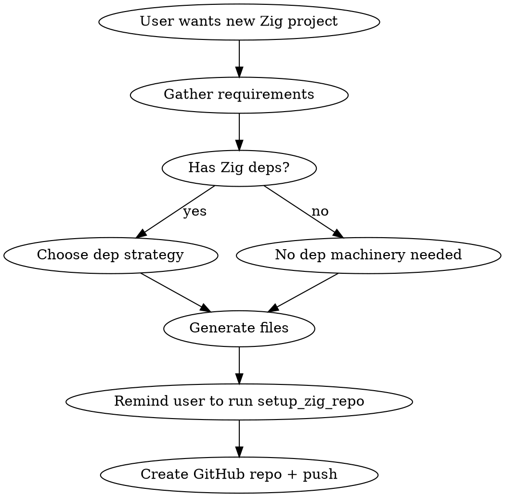

# Scaffold Zig Project

## Overview

Generate the complete boilerplate for a new Zig project following Peter's hexagonal architecture pattern: pure Zig core (no I/O), C FFI boundary, C CLI consumer. Includes Nix flake with Garnix CI, build.zig, build.zig.zon, PLAN.md, and .gitignore.

<important>
The user already has `setup_zig_repo` in their shell which handles: jj/git init, AGENTS.md/CLAUDE.md links, jj cheatsheet, Zig guide, commit hooks, and some .gitignore entries. This skill covers everything that alias does NOT: flake.nix, build.zig, build.zig.zon, directory structure, PLAN.md, and remaining .gitignore entries.
</important>

<when_to_use>
- User says "new project", "start a new Zig project", "scaffold", "greenfield"
- User wants to create a Zig library, tool, or codec from scratch
- User is setting up build infrastructure for a new Zig codebase
</when_to_use>

## Workflow



### Step 1: Gather Requirements

Ask/determine these before generating:

| Question | Default | Affects |
|----------|---------|---------|
| Project name (underscored) | required | everywhere |
| CLI name (hyphenated) | `project-name` | build.zig, flake.nix |
| One-line description | required | flake.nix, PLAN.md |
| Has Zig dependencies? | no | flake.nix dep strategy |
| Needs macOS system headers? | no | Darwin nativeBuildInputs |
| Optimize mode | ReleaseFast | build.zig, flake.nix |
| Include C FFI + C CLI? | yes (hexagonal) | build.zig directory structure |

### Step 2: Generate Directory Structure

For hexagonal (C FFI) projects:
```
project_name/
  src/
    lib.zig           # Core library (pure Zig, no I/O, exports C FFI)
  include/
    project_name.h    # C header for the FFI
  cli/
    main.c            # C CLI that calls through FFI
  flake.nix
  build.zig
  build.zig.zon
  PLAN.md
```

For pure-Zig projects (no C FFI):
```
project_name/
  src/
    main.zig          # Entry point
    lib.zig           # Core library (if also a library)
  flake.nix
  build.zig
  build.zig.zon
  PLAN.md
```

### Step 3: Generate Files

Use the templates below. After generating, remind the user:

> Run `setup_zig_repo` in the project directory to set up jj/git, AGENTS.md, CLAUDE.md, hooks, and base .gitignore entries.

Then append the additional .gitignore entries (see template below) that `setup_zig_repo` doesn't cover.

### Step 4: GitHub + CI

```bash
gh repo create pmarreck/PROJECT_NAME --public --source=. --push
```

<remember>
Garnix is installed org-wide -- no per-repo config needed. It auto-evaluates `packages` and `checks` from `flake.nix`.
</remember>

---

## Templates

### flake.nix (no dependencies)

<template>
```nix
{
  description = "{{DESCRIPTION}}";

  inputs = {
    nixpkgs.url = "github:NixOS/nixpkgs/nixpkgs-unstable";
    flake-utils.url = "github:numtide/flake-utils";
  };

  outputs = { self, nixpkgs, flake-utils }:
    flake-utils.lib.eachDefaultSystem (system:
      let
        pkgs = import nixpkgs { inherit system; };
        pname = "{{PNAME}}";
        version = "0.1.0";
        zigPkg = pkgs.zig;
      in {
        packages.default = pkgs.stdenv.mkDerivation {
          inherit pname version;
          src = ./.;
          nativeBuildInputs = [ zigPkg ];
          dontConfigure = true;
          dontFixup = true;
          buildPhase = ''
            export HOME=$TMPDIR
            ${pkgs.lib.optionalString pkgs.stdenv.isDarwin "unset NIX_CFLAGS_COMPILE NIX_LDFLAGS"}
            zig build -Doptimize=ReleaseFast --prefix $out
          '';
          dontInstall = true;
        };

        checks.${system} = {
          build = self.packages.${system}.default;
          test = pkgs.stdenv.mkDerivation {
            pname = "${pname}-test";
            inherit version;
            src = ./.;
            nativeBuildInputs = [ zigPkg ];
            dontConfigure = true;
            dontFixup = true;
            buildPhase = ''
              export HOME=$TMPDIR
              ${pkgs.lib.optionalString pkgs.stdenv.isDarwin "unset NIX_CFLAGS_COMPILE NIX_LDFLAGS"}
              timeout 600 zig build test || { echo "Tests failed"; exit 1; }
            '';
            installPhase = ''
              mkdir -p $out
              echo "tests passed" > $out/result
            '';
          };
        };

        devShells.default = pkgs.mkShell {
          packages = [ zigPkg pkgs.hyperfine ];
        };
      });
}
```
</template>

### flake.nix addition: zigDeps (fixed-output derivation)

When the project has Zig dependencies, add this to the `let` block and wire it into buildPhase:

<template>
```nix
        # Set to pkgs.lib.fakeHash, run `nix build`, use printed hash
        zigDepsHash = "sha256-AAAAAAAAAAAAAAAAAAAAAAAAAAAAAAAAAAAAAAAAAAA=";
        zigDeps = pkgs.stdenv.mkDerivation {
          pname = "${pname}-zig-deps";
          inherit version;
          src = ./.;
          nativeBuildInputs = [ zigPkg pkgs.git pkgs.cacert ];
          outputHashMode = "recursive";
          outputHashAlgo = "sha256";
          outputHash = zigDepsHash;
          dontFixup = true;
          dontPatchShebangs = true;
          buildPhase = ''
            export HOME=$TMPDIR
            export ZIG_GLOBAL_CACHE_DIR=$TMPDIR/zig-cache
            mkdir -p $ZIG_GLOBAL_CACHE_DIR
            export SSL_CERT_FILE=${pkgs.cacert}/etc/ssl/certs/ca-bundle.crt
            zig build --fetch=all
          '';
          installPhase = ''
            mkdir -p $out
            cp -r $TMPDIR/zig-cache/p $out/p
          '';
        };
```

And in the package/test buildPhase, before `zig build`:
```nix
            export ZIG_GLOBAL_CACHE_DIR=$TMPDIR/zig-cache
            mkdir -p $ZIG_GLOBAL_CACHE_DIR
            cp -r ${zigDeps}/* $ZIG_GLOBAL_CACHE_DIR/
            chmod -R u+w $ZIG_GLOBAL_CACHE_DIR
```
</template>

### build.zig (hexagonal: Zig core + C FFI + C CLI)

<template>
```zig
const std = @import("std");

pub fn build(b: *std.Build) void {
    const target = b.standardTargetOptions(.{});
    const optimize = b.option(
        std.builtin.OptimizeMode,
        "optimize",
        "Optimization mode (default: ReleaseFast)",
    ) orelse .ReleaseFast;

    // -- Core library module (pure Zig, no I/O) --
    const core_mod = b.addModule("{{PROJECT_NAME}}", .{
        .root_source_file = b.path("src/lib.zig"),
        .target = target,
        .optimize = optimize,
    });
    _ = core_mod; // exposed for downstream Zig consumers

    // -- Static library with C ABI (FFI boundary) --
    const lib = b.addLibrary(.{
        .name = "{{PROJECT_NAME}}",
        .linkage = .static,
        .root_module = b.createModule(.{
            .root_source_file = b.path("src/lib.zig"),
            .target = target,
            .optimize = optimize,
            .link_libc = true,
        }),
    });
    b.installArtifact(lib);

    // -- C CLI executable (dogfoods the FFI) --
    const cli_mod = b.createModule(.{
        .target = target,
        .optimize = optimize,
        .link_libc = true,
    });
    cli_mod.addCSourceFile(.{
        .file = b.path("cli/main.c"),
        .flags = &.{ "-std=c11", "-Wall", "-Wextra" },
    });
    cli_mod.addIncludePath(b.path("include"));
    const cli = b.addExecutable(.{
        .name = "{{CLI_NAME}}",
        .root_module = cli_mod,
    });
    cli.linkLibrary(lib);
    b.installArtifact(cli);

    // -- Run step --
    const run_cmd = b.addRunArtifact(cli);
    run_cmd.step.dependOn(b.getInstallStep());
    if (b.args) |args| run_cmd.addArgs(args);
    b.step("run", "Run the CLI").dependOn(&run_cmd.step);

    // -- Unit tests --
    const run_tests = b.addRunArtifact(b.addTest(.{
        .root_module = b.createModule(.{
            .root_source_file = b.path("src/lib.zig"),
            .target = target,
            .optimize = optimize,
        }),
    }));
    b.step("test", "Run unit tests").dependOn(&run_tests.step);
}
```
</template>

### build.zig (pure Zig, no C FFI)

<template>
```zig
const std = @import("std");

pub fn build(b: *std.Build) void {
    const target = b.standardTargetOptions(.{});
    const optimize = b.option(
        std.builtin.OptimizeMode,
        "optimize",
        "Optimization mode (default: ReleaseFast)",
    ) orelse .ReleaseFast;

    const exe = b.addExecutable(.{
        .name = "{{CLI_NAME}}",
        .root_module = b.createModule(.{
            .root_source_file = b.path("src/main.zig"),
            .target = target,
            .optimize = optimize,
        }),
    });
    b.installArtifact(exe);

    const run_cmd = b.addRunArtifact(exe);
    run_cmd.step.dependOn(b.getInstallStep());
    if (b.args) |args| run_cmd.addArgs(args);
    b.step("run", "Run the executable").dependOn(&run_cmd.step);

    const run_tests = b.addRunArtifact(b.addTest(.{
        .root_module = b.createModule(.{
            .root_source_file = b.path("src/main.zig"),
            .target = target,
            .optimize = optimize,
        }),
    }));
    b.step("test", "Run unit tests").dependOn(&run_tests.step);
}
```
</template>

### build.zig.zon

<template>
```zig
.{
    .name = .{{PROJECT_NAME}},
    .version = "0.1.0",
    .minimum_zig_version = "0.15.2",
    .dependencies = .{},
    .paths = .{
        "build.zig",
        "build.zig.zon",
        "src",
        "include",
        "cli",
    },
    .fingerprint = 0x0000000000000000,
}
```
</template>

Note: `.fingerprint` is auto-generated by `zig build` on first run.

### .gitignore additions (beyond setup_zig_repo)

Append these after running `setup_zig_repo`:

<template>
```gitignore

# Zig build artifacts
zig-out/
zig-cache/
.zig-cache/

# Nix build result symlinks
result
result-*

# macOS
.DS_Store

# LLM inbox (inter-project messages)
inbox/

# Tooling indexes
.codescan/
.serena/
```
</template>

### PLAN.md

<template>
```markdown
# {{Project Title}} -- Plan

## In Progress
- [ ] Initial scaffolding and CI setup

## Future Enhancements
- [ ] (add items as they arise)

## Completed
```
</template>

### Starter src/lib.zig (hexagonal)

<template>
```zig
const std = @.import("std");

// ── Public Zig API ──────────────────────────────────────────────────

// TODO: Add core logic here. This module must have NO I/O.

// ── C FFI exports ───────────────────────────────────────────────────

export fn {{project_name}}_version() [*:0]const u8 {
    return "0.1.0";
}

// ── Tests ───────────────────────────────────────────────────────────

test "version returns valid string" {
    const v = {{project_name}}_version();
    try std.testing.expect(v[0] == '0');
}
```
</template>

### Starter include/project_name.h

<template>
```c
#ifndef {{PROJECT_NAME_UPPER}}_H
#define {{PROJECT_NAME_UPPER}}_H

const char* {{project_name}}_version(void);

#endif
```
</template>

### Starter cli/main.c

<template>
```c
#include <stdio.h>
#include "{{project_name}}.h"

int main(int argc, char* argv[]) {
    (void)argc;
    (void)argv;
    printf("{{project_name}} version %s\n", {{project_name}}_version());
    return 0;
}
```
</template>

## Common Mistakes

<important>
- **Forgetting `export HOME=$TMPDIR`** in flake.nix buildPhase -- Zig needs a writable HOME
- **Missing `dontConfigure = true`** -- Nix tries to run `./configure` otherwise
- **Using `main` branch** -- Peter's projects always use `yolo`
- **Skipping Garnix checks** -- Always include `checks` in flake.nix; Garnix auto-detects them
- **Importing Zig core directly from a Zig CLI** -- The CLI MUST call through the C FFI to dogfood the boundary, even when both are Zig
</important>
