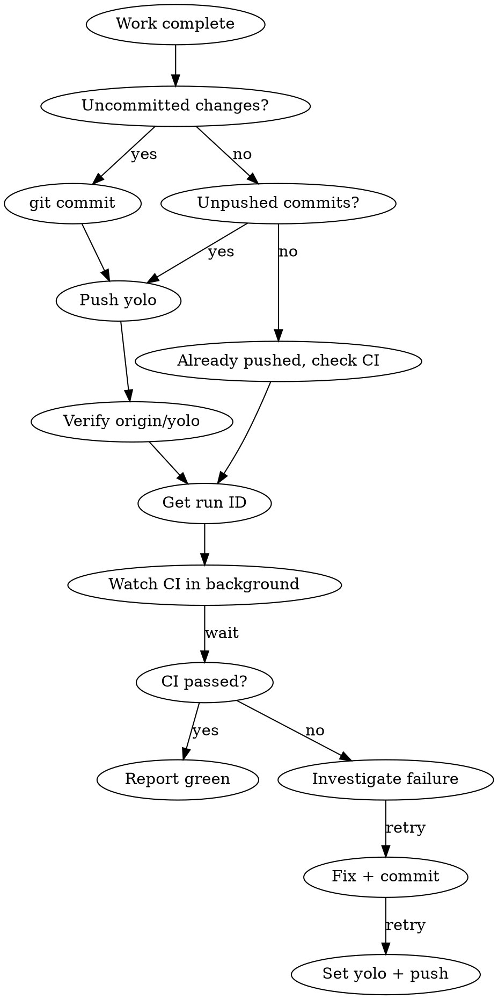

# Ship

## Overview

Commit (if needed), push, and watch Garnix CI until green. On failure, investigate and fix automatically.

> **SCM is direct `git`.** The main branch is `yolo`. Keep commits focused,
> never force-push unless Peter explicitly requests it, and independently verify
> that `origin/yolo` equals the local commit after every push.

<important>
This is the default completion step for any unit of work. The user considers push+CI the natural end of every task, not an optional extra.
</important>

<when_to_use>
- User says "push", "ship", "push it", "commit and push", "check CI"
- You just finished a bugfix, feature, or refactor and the user hasn't said NOT to push
- User asks "you push it yet?" (you should have already done this)
</when_to_use>

<when_not_to_use>
- User explicitly says "don't push yet" or "hold off on pushing"
- You're in the middle of multi-step work that isn't ready
- Working in a worktree that hasn't been merged yet
</when_not_to_use>

## Workflow



### Step 1: Commit (if needed)

Inspect the branch and worktree first:

```bash
git status --short --branch
git diff --check
```

Stage only the intended paths, review the staged diff, and commit:

```bash
git add -- <path> <path>
git diff --cached --check
git diff --cached --stat
git commit -m "<message>"
```

Follow the repo's commit message conventions. Keep messages concise and
focused on why. Preserve unrelated worktree edits and never commit `.env`,
credentials, generated release binaries, or other out-of-scope files.

<important>
Do not use `git add -A` in a dirty worktree. Explicit paths are the control that
keeps Peter's or another agent's concurrent edits out of your commit.
</important>

### Step 2: Push and verify

<important>
Do not infer success merely because `git push` exited zero. Fetch the
remote-tracking ref and compare commit IDs as an independent control.
</important>

```bash
branch="$(git branch --show-current)"
[ "$branch" = "yolo" ] || { echo "expected yolo, found $branch" >&2; exit 1; }
git push origin yolo
git fetch origin yolo

local_rev="$(git rev-parse HEAD)"
remote_rev="$(git rev-parse refs/remotes/origin/yolo)"
[ "$local_rev" = "$remote_rev" ] || {
  echo "push verification failed: HEAD=$local_rev origin/yolo=$remote_rev" >&2
  exit 1
}
```

If the push is rejected because the remote advanced, fetch and inspect the new
commits. Integrate them without rewriting published history, rerun tests, and
push again.

### Step 3: Get the CI Run

Wait a few seconds after push, then:

```bash
gh run list --limit 5
```

Find the most recent run triggered by the push. Get its ID.

### Step 4: Watch CI in Background

```bash
gh run watch <run-id>
```

Run this as a background task. Report the result when it completes.

### Step 5: Handle Result

**If green:** Report "CI passed" and move on.

**If red:** Do NOT just report the failure. Investigate:

1. `gh run view <run-id> --log-failed` to see what failed
2. Diagnose the root cause
3. Fix it
4. Loop back to Step 1 (commit, push, watch again)

## Red Flags

| Thought | Reality |
|---------|---------|
| "Let me ask if they want me to push" | Just push. They always want you to push. |
| "CI is someone else's problem" | You own the full cycle: push, watch, fix. |
| "I'll just report the failure" | No. Investigate and fix. Then re-push. |
| "I'll push later" | Push now. This IS the end of the task. |
| "The user didn't say push" | Completing work implies shipping it. |

## Common CI Failure Patterns

- **Nix hash mismatch** -- Zig deps changed. See `fix-zig-deps-hash` skill.
- **Test timeout** -- Tests hanging. Check for infinite loops or missing test termination.
- **macOS build failure** -- Missing `unset NIX_CFLAGS_COMPILE NIX_LDFLAGS` in flake.nix.
- **Missing file in Nix sandbox** -- Flake sources include Git-tracked files;
  an untracked or ignored source file is absent. Check `git status --short`,
  add the intended source, commit it, and rerun the build.

---

## Cutting a Release (optional)

After CI is green, publish a tagged release so downstream users see a human-readable changelog on `github.com/OWNER/REPO/releases`. Do this when:

- The user says "release", "cut release", "publish", "tag it"
- A shipped commit is meaningfully user-visible (fix/feature), not purely internal (docs, tests, refactor). Ask the user if unsure.

### Tag format

**CalVer + short SHA:** `YYYYMMDD.<7-char-commit-hash>` (e.g. `20260424.a028026`).

- No version-number decisions ever — date + hash is unambiguous.
- Multiple releases same day are unique by hash.
- `git rev-parse --short=7 HEAD` gives the short hash of the committed work.

### Commands

<template>
```bash
# Release the committed HEAD that you already pushed onto yolo in Step 2.
SHA7="$(git rev-parse --short=7 HEAD)"
TAG="$(date +%Y%m%d).${SHA7}"
PREV_TAG="$(gh release list --limit 1 --json tagName --jq '.[0].tagName' 2>/dev/null)"

# Normal release: auto-bulleted commit subjects since the last tag.
# No prior tag (first release): RANGE collapses to HEAD; hand-curate instead.
RANGE="${PREV_TAG:+${PREV_TAG}..}HEAD"
git log --format='- %s' "$RANGE" > /tmp/release-body.md
gh release create "$TAG" --target yolo \
  --title "$TAG" --notes-file /tmp/release-body.md

# For a major release with many commits — hand-curate /tmp/release-body.md
# (grouped by theme: Features / Fixes / Under the hood), then same command.
```
</template>

<important>
`gh release create --generate-notes` (GitHub's auto-generator) only produces useful output when the repo uses PRs. For direct-to-`yolo` workflows, it emits just a compare link. Use `--notes-file` with `git log` output instead.
</important>

### After publishing

- Report the release URL to the user.
- For a hand-curated release, consider a trailing `**Full commit log:** https://github.com/OWNER/REPO/compare/PREV_TAG...TAG` line so readers can drill in.

---

## CI Setup (one-time per repo)

If the repo is missing CI infrastructure, set it up before the first ship. Check for these and create any that are missing:

### Garnix

<remember>
Garnix is installed org-wide as a GitHub App — no per-repo config needed. It auto-evaluates `packages.*` and `checks.*` from `flake.nix`. Do NOT create a `garnix.yaml` unless you need to restrict what gets built.
</remember>

### GitHub Actions

Create `.github/workflows/ci.yml` if it doesn't exist:

<template>
```yaml
name: CI

on:
  push:
    branches: [yolo]
  pull_request:
    branches: [yolo]

jobs:
  build-and-test:
    strategy:
      matrix:
        os: [ubuntu-latest, macos-latest]
    runs-on: ${{ matrix.os }}
    steps:
      - uses: actions/checkout@v4

      - uses: DeterminateSystems/nix-installer-action@main
      - uses: DeterminateSystems/magic-nix-cache-action@main

      - name: Build
        run: nix build

      - name: Test
        run: nix develop -c zig build test
```
</template>

Adapt the test command to the project (not all projects use `zig build test`). The build step (`nix build`) should be universal for any Nix-based project.

### Target Platforms

For CLI-only projects and UI-less system-level libraries, target **5 platforms**:

| OS      | aarch64              | x86_64              |
|---------|----------------------|---------------------|
| macOS   | `aarch64-macos`      | --                  |
| Linux   | `aarch64-linux-musl` | `x86_64-linux-musl` |
| Windows | `aarch64-windows-gnu`| `x86_64-windows-gnu`|

<important>
- macOS Intel (x86_64-darwin) is NOT supported — Apple dropped it and GitHub Actions no longer offers Intel Mac runners.
- Linux builds MUST use musl (`-musl` suffix) for fully static binaries with no glibc dependency.
- Windows uses `-gnu` (MinGW) for Zig cross-compilation compatibility.
</important>

Ensure the `flake.nix` exposes `packages.*` for all supported systems so Garnix can build them. For Zig cross-compilation, use `-Dtarget=` in the flake build phase and expose each as a separate flake output (e.g., `packages.x86_64-linux`, `packages.aarch64-windows`).

**GitHub Actions cross-compile job** (add alongside the native build-and-test job):

<template>
```yaml
  cross-compile:
    runs-on: ubuntu-latest
    strategy:
      matrix:
        target:
          - aarch64-macos
          - aarch64-linux
          - x86_64-linux
          - aarch64-windows
          - x86_64-windows
    steps:
      - uses: actions/checkout@v4
      - uses: DeterminateSystems/nix-installer-action@main
      - uses: DeterminateSystems/magic-nix-cache-action@main
      - name: Cross-compile for ${{ matrix.target }}
        run: nix build .#${{ matrix.target }}
```
</template>

### Badges

Add these to the top of the main `README.md`, right after the title line (`# project-name`):

**Garnix badge** (branch-specific):
```markdown
[](https://garnix.io/repo/OWNER/REPO)
```

**GitHub Actions badge** (branch-specific):
```markdown
[](https://github.com/OWNER/REPO/actions/workflows/ci.yml)
```

Replace `OWNER`, `REPO`, and `BRANCH` (almost always `pmarreck`, the repo name, and `yolo`).

<template>
**Template for copy-paste** (fill in REPO):
```markdown
[](https://garnix.io/repo/pmarreck/REPO)
[](https://github.com/pmarreck/REPO/actions/workflows/ci.yml)
```
</template>
